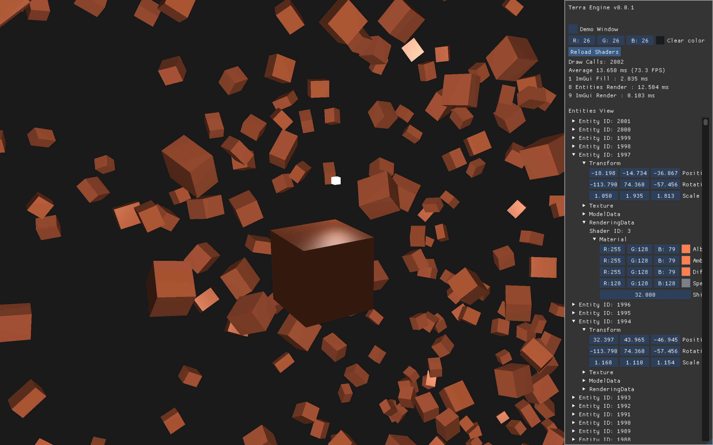

# Terra Engine (🚧 In Progress)
#### Powered by OpenGL


##### The Engine In Action:



## Installation:
The Engine build files are prepared with **CMake** and your chosen build tool (`make`, `ninja` etc) is used as for compilation. (This is currently mac-specific)

To Clone
```bash
git clone https://github.com/bogger12/Terra.git
cd Terra
```
To build with **CMake**
```bash
cmake -S . -B build
cmake --build build
```

To run the Engine
```bash
cd build/bin
./Terra
```
## Controls:

- **WASD** : *Move Camera*
- **Mouse** : *Rotate Camera*
- **TAB** : *Enter/Exit Camera Mode*


## Libraries Used:
GLFW3 - Window Management

OpenGL - 3D Rendering

GLAD - OpenGL Extension Loader

[ENTT](https://github.com/skypjack/entt) - Entity Component System

[Dear ImGui](https://github.com/ocornut/imgui#) - Immediate-Mode GUI
